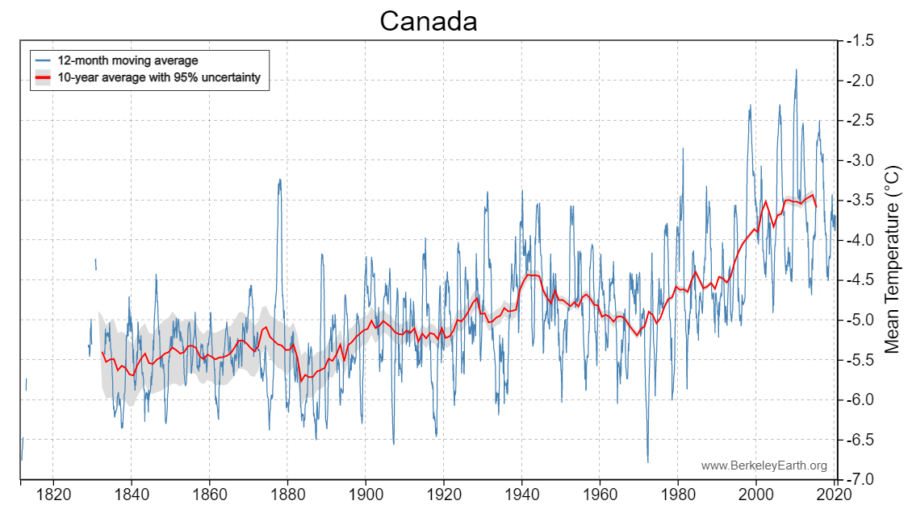

# Group 33 - Climate Change

- Your title can change over time.

## Milestones

Details for Milestone are available on Canvas (left sidebar, Course Project).

## Describe your topic/interest in about 150-200 words

We will be analyzing datasets that include the temperature ranges from the 18th century to the 21st century and determine if these datasets can validate that climate change is in fact a real problem we are facing today. We will also try to determine how the temperature change may have an impact on various Indigenous communities around British Columbia, Canada.

## Describe your dataset in about 150-200 words

The datasets referenced below include Worldwide temperature data, though our focus, if possible, will be specific to British Columbia. The years with which this data is gathered range from 1750 to 2017. 

## Team Members

- Kalli Van Stone: one sentence about you!
- Allysa Webber: one sentence about you!
- Sarah Quesnelle: I am a 4th year Mathematics student.

## Images

{You should use this area to add a screenshot of an interesting plot, or of your dashboard}

## References

### Temperature data gathered in Canada, dates range from 1917 - 2017
https://data.world/pegarciadotcom/canada-monthly-weather-data-1917-2017-dataloversbrazil  
Public Domain License

### Temperature data gathered around the World, dates range from 1750 - 2015.
https://data.world/data-society/global-climate-change-data  
https://berkeleyearth.org/data/  
Berkeley Earth’s data is licensed under Creative Commons BY-NC 4.0 International

### Canadian Well-Being Index
https://open.canada.ca/data/en/dataset/56578f58-a775-44ea-9cc5-9bf7c78410e6  
Open Government License - Canada

### Temperature Data Heat Map for BC
https://open.canada.ca/data/en/dataset/2364749d-70a0-4874-956d-a636401ac5a6/resource/6ade85af-8d5e-4d6e-a429-6cf8d87516ba?inner_span=True  
Open Government License - Canada
