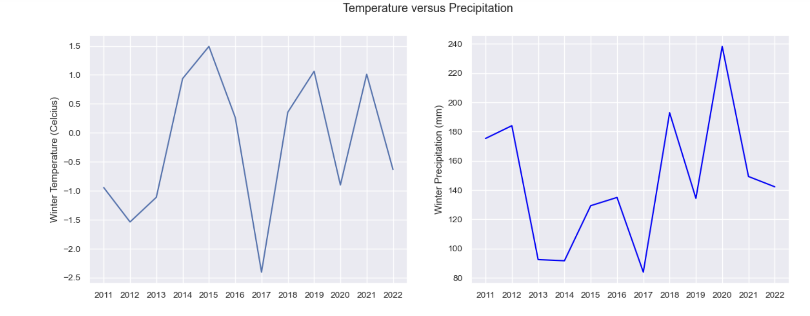
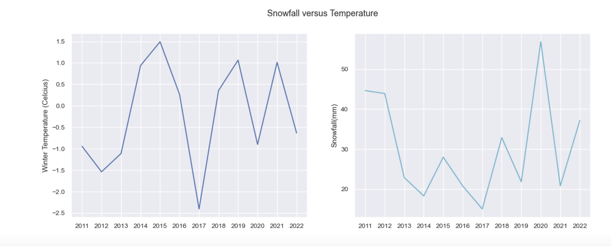
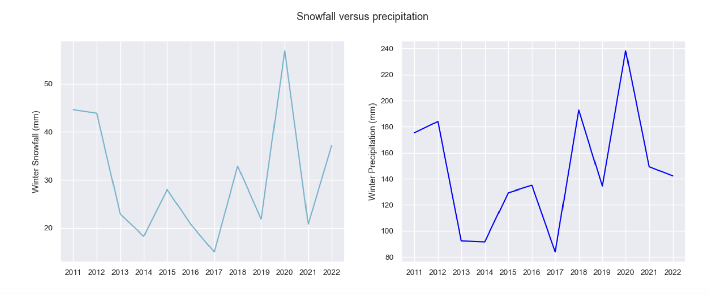

## Introduction
#### This data analysis was done using datasets from the data.world, which provided monthly weather data from Canada from 1917-2023. This original data frame included 24 columns of various climate values and identifiers. The dataset was pared down to include latitude, longitude, location name, temperature, precipitation, and snowfall. The idea was to use this data to observe and make predictions about changes in mean values throughout the years, and how different values will interact with each other, both within and across seasons. This analysis provides insight into climate change and variability, and some overall insights into how weather patterns interact.
## Exploratory Data analysis

## Question 1
## Results 2

## Question 2
#### How do climate values interact with one another? Is one value predictive of another? With this question I wanted to explore how climate values might covary. My hypothesis was that warmer years would likely coincide with more precipitation and less snow, and colder years might result in less precipitation and snow. I chose to take all of my values from winter(January), to keep this variable constant.   

## Results 2
#### My visualisations of temperature versus snow, and temperature versus precipitation showed some patterns, with lower temperatures being predictive of lower snowfall values, as well as lower precipitation values from 2011- 2018. The pattern appears to reverse after this point, making it difficult to make any concrete statements about the interaction. Precipitation and snowfall appeared to covary across the years, with high precipitation years correlating with high snowfall years overall. This leads me to the thought that precipitation and snowfall values are often correlated, but temperature interactions are more complex, and would require a longer projection to comment on effectively.

## Question 3
## Results 3

## Summary/Conclusion
