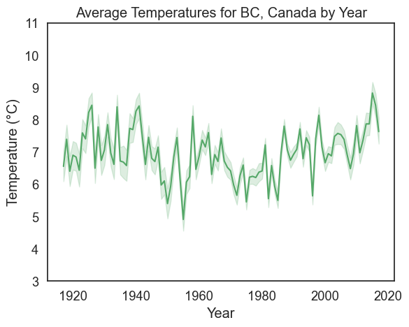
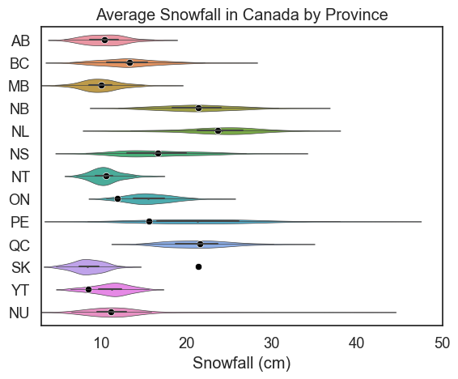
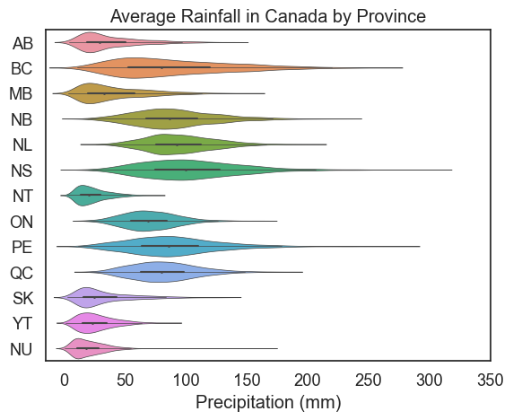
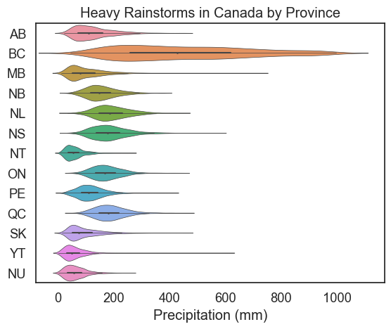

# Project Final Report

## Introduction

The data analysis performed here was completed using datasets from the [data.world](https://data.world/pegarciadotcom/canada-monthly-weather-data-1917-2017-dataloversbrazil) website, which provided monthly weather data that was colledted collected within Canada between the years 1917 and 2023. This original data frame included 24 columns of various climate values and identifiers. The dataset was then pared down to include latitude, longitude, year, month, station name, temperature, precipitation, and snowfall. The idea was to use this data to observe and make predictions about changes in average values throughout the years, and how different values will interact with each other, both within and across seasons. This analysis provides insight into climate change and variability, and some overall insights into how weather patterns interact.

## Exploratory Data analysis

Some exploration done in this data set required visualizing all of the climate variables across January in order to look for patterns.

## Question 1

Has there been a significant change in average temperature for BC, Canada since the year 1917?
On average, which Province receives the most snowfall in Canada since 1917?

     

          
     

     

          
     

     

          
     

     

          
     

### Results 1

Sarah concludes that, yes, there has been a significant change in average temperature for BC, Canada as the temerature variability ranges from 5 degrees Celsius to 9 degrees Celsius. However, this graph also shows that the overall average temperature change from the year 1917 to 2017 is only 1 degree Celsius. Another interesting fact is that there has been a general upward trend in the average temperature for BC since the mid to late 1970s.

## Question 2

How do climate values interact with one another? Is one value predictive of another? With this question, Allysa wanted to explore how climate values might correlate. Allysa's hypothesis was that warmer years would likely coincide with more precipitation and less snow, and colder years might result in less precipitation and more snow. I chose to take all of my values from winter(January), to keep this variable constant.

### Results 2

Visualisations of temperature versus snow, and temperature versus precipitation showed some patterns, with lower temperatures being predictive of lower snowfall values, as well as lower precipitation values from 2011 to 2018. The pattern appears to reverse after this point, making it difficult to make any concrete statements about the interaction. Precipitation and snowfall appeared to covary across the years, with high precipitation years correlating with high snowfall years overall. This leads me to the thought that precipitation and snowfall values are often correlated, but temperature interactions are more complex, and would require a longer projection to comment on effectively.

## Question 3

## Results 3

## Summary/Conclusion

Some take away's from Allysa's analysis include an increased awareness for the complexities of climate interactions. While some patterns can be gleaned from short term projections, it is not likely that real and meaningful conclusions can be reached using short term data. Further analysis should include longer projections, and data taken across more seasons, in order to support and add to patterns that were seen in the analysis.
